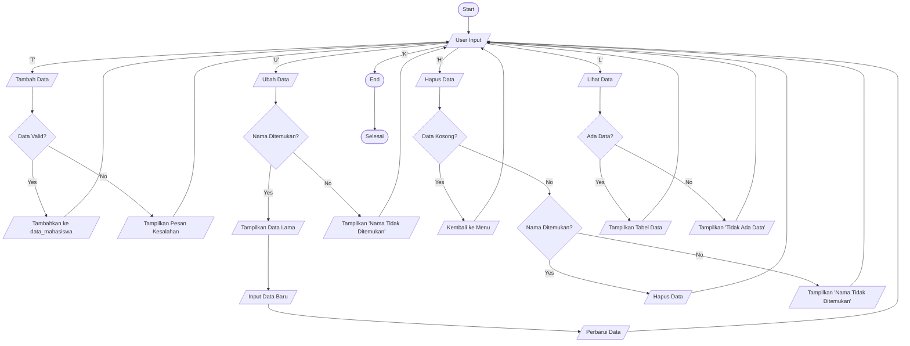

# Tugas Pratikum 
  Membuat pemrograman fungai tambah, fungsi tampilkan, fungsi hapus, fungsi ubah
# Codingan 
```
data_mahasiswa = {}

def tambah(data_lama, data_baru): 
    data_mahasiswa [data_lama] = data_baru 
    print(f'data {data_lama} berhasil di tambahkan')

def tampilkan() :
    if data_mahasiswa:
        print("daftar nilai mahasiswa")
        for data_lama, data_baru in data_mahasiswa.items():
            print(f'Nama : {data_lama} ==== Nilai : {data_baru}' )
        else:
            (f'belom ada data mahasiswa')
            
def hapus_data(data_lama):
    if data_lama in data_mahasiswa:
        del data_mahasiswa [data_lama]
        print(f'data mahasiswa {data_lama} berhasil di hapus')
    else:
        print('tidak ada data {data_lama} silahkan masukan lagi dengan nama yang benar')
        
def ubah (data_lama, data_baru):
    if data_lama in data_mahasiswa:
        data_mahasiswa[data_lama] = data_baru
        print(f'Data mahasiswa {data_lama} berhasil di ubah ')
    else:
        print(f'tidak ada data {data_lama} silahkan masukan lagi dengan nama yang benar')    
        
while True:
    print("===Daftar Pilihan===")
    print("1.Tambah Data")
    print("2.Tampilkan Data")
    print("3.Hapus Data")
    print("4.Ubah Data")
    print("5.Keluar")
    
    pilihan = input("masukan pilihan (1-5) : ")
    
    if pilihan == "1":
        data_lama = input("Masukan Nama Mahasiswa : ")
        data_baru = input("Masukan Nilai : ")
        tambah(data_lama,data_baru)
    elif pilihan == "2":
        tampilkan()
    elif pilihan == "3":
        data_lama = input("masukan data yang mau di hapus: ")
        hapus_data(data_lama)
    elif pilihan == "4":
        data_lama = input("masukan nama mahasiswa yang mau di ubah nilainya: ")
        data_baru = input("masukan nilai yang akan di ubah: ")
        ubah(data_lama,data_baru)
    elif pilihan == "5":
        break

    else:
        print("data mahasiswa tidak ada")
    
```
# Fungsi Tambah Beserta Outputnya
```
def tambah(data_lama, data_baru): 
    data_mahasiswa [data_lama] = data_baru 
    print(f'data {data_lama} berhasil di tambahkan')
```
Fungsi ini di tunjukan untuk menambahkan data. 
```
===Daftar Pilihan===
1.Tambah Data
2.Tampilkan Data
3.Hapus Data
4.Ubah Data
5.Keluar
masukan pilihan (1-5) : 1
Masukan Nama Mahasiswa : vito
Masukan Nilai : 100
```

# Fungsi Tampikan Beserta Outputnya
```
def tampilkan() :
    if data_mahasiswa:
        print("daftar nilai mahasiswa")
        for data_lama, data_baru in data_mahasiswa.items():
            print(f'Nama : {data_lama} ==== Nilai : {data_baru}' )
        else:
            (f'belom ada data mahasiswa')
```
Fungsi ini di tunjukan untuk menampilkan data yang kita punya dalam sistem
```
===Daftar Pilihan===
1.Tambah Data
2.Tampilkan Data
3.Hapus Data
4.Ubah Data
5.Keluar
masukan pilihan (1-5) : 2
daftar nilai mahasiswa
Nama : vito ==== Nilai : 100
```

# Fungsi Hapus Beserta Outputnya
```
def hapus_data(data_lama):
    if data_lama in data_mahasiswa:
        del data_mahasiswa [data_lama]
        print(f'data mahasiswa {data_lama} berhasil di hapus')
    else:
        print('tidak ada data {data_lama} silahkan masukan lagi dengan nama yang benar')
```
Fungsi ini di tunjukan untuk menghapus data dengan menginput nama mahasiswa yang terdaftar di dalam sistem 
```
===Daftar Pilihan===
1.Tambah Data
2.Tampilkan Data
3.Hapus Data
4.Ubah Data
5.Keluar
masukan pilihan (1-5) : 3
masukan data yang mau di hapus: vito
data mahasiswa vito berhasil di hapus
```

# Fungsi Ubah Data Beserta Outputnya
```
def ubah (data_lama, data_baru):
    if data_lama in data_mahasiswa:
        data_mahasiswa[data_lama] = data_baru
        print(f'Data mahasiswa {data_lama} berhasil di ubah ')
    else:
        print(f'tidak ada data {data_lama} silahkan masukan lagi dengan nama yang benar')  
```
Dengan fungsi ini kita dapat menubah nilai kita hanya dengan memasukan nama yang ada di dalam sistem
```
===Daftar Pilihan===
1.Tambah Data
2.Tampilkan Data
3.Hapus Data
4.Ubah Data
5.Keluar
masukan pilihan (1-5) : 4
masukan nama mahasiswa yang mau di ubah nilainya: vito
masukan nilai yang akan di ubah: 99
Data mahasiswa vito berhasil di ubah
```

# Flowchart 



    
